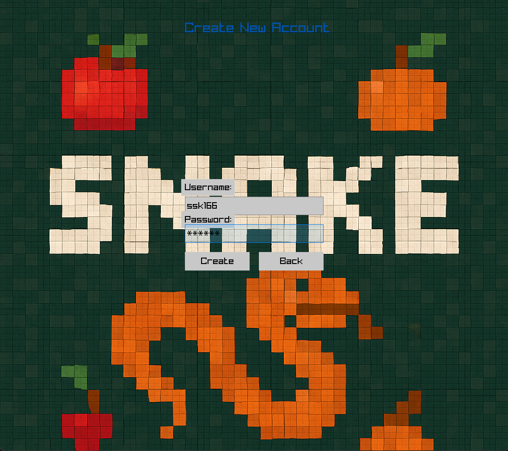
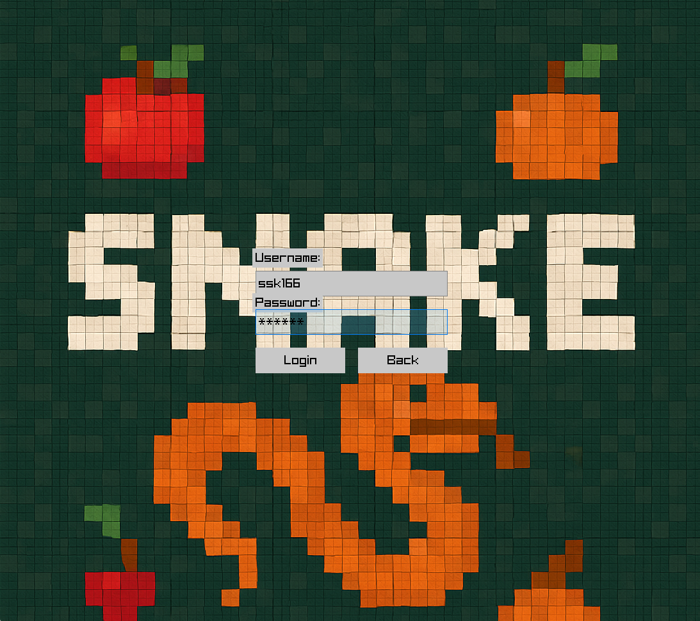
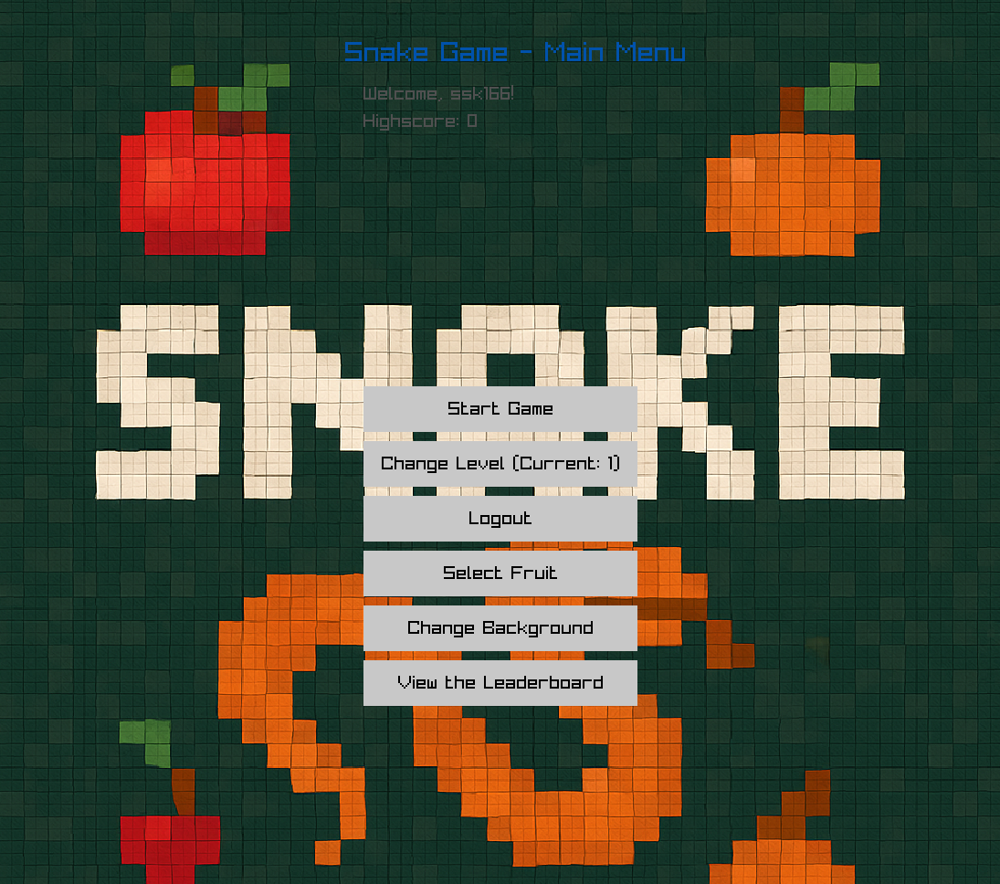
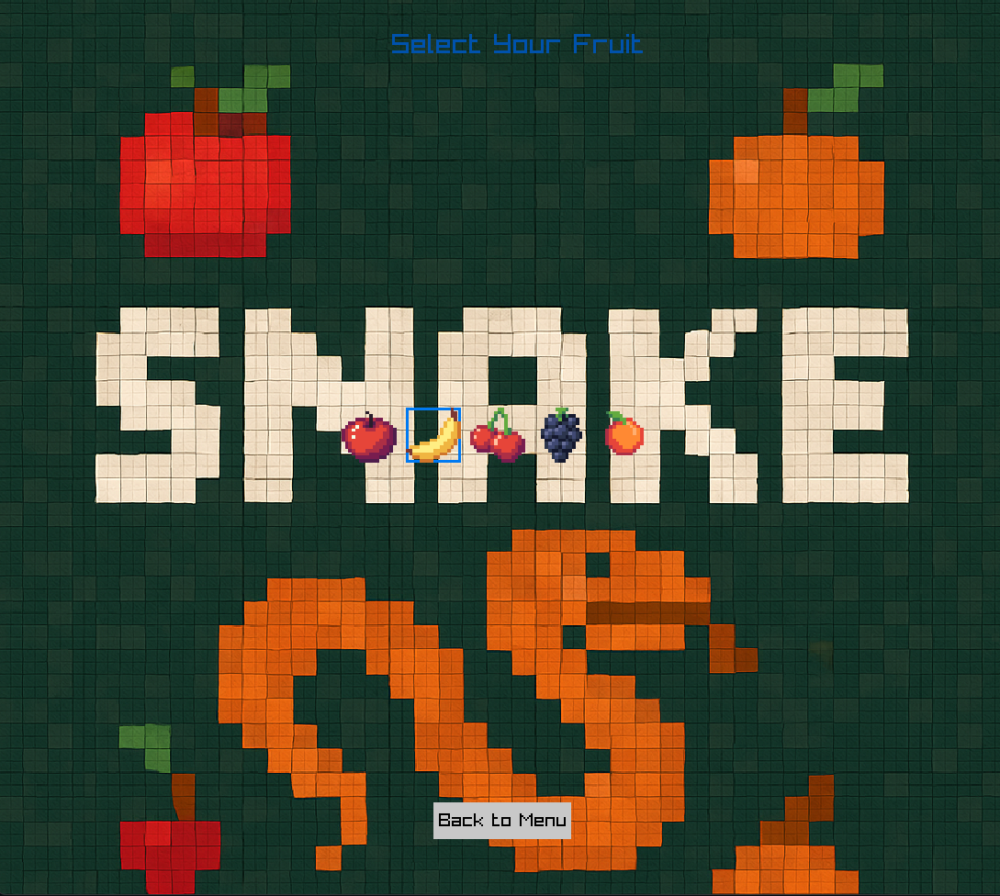
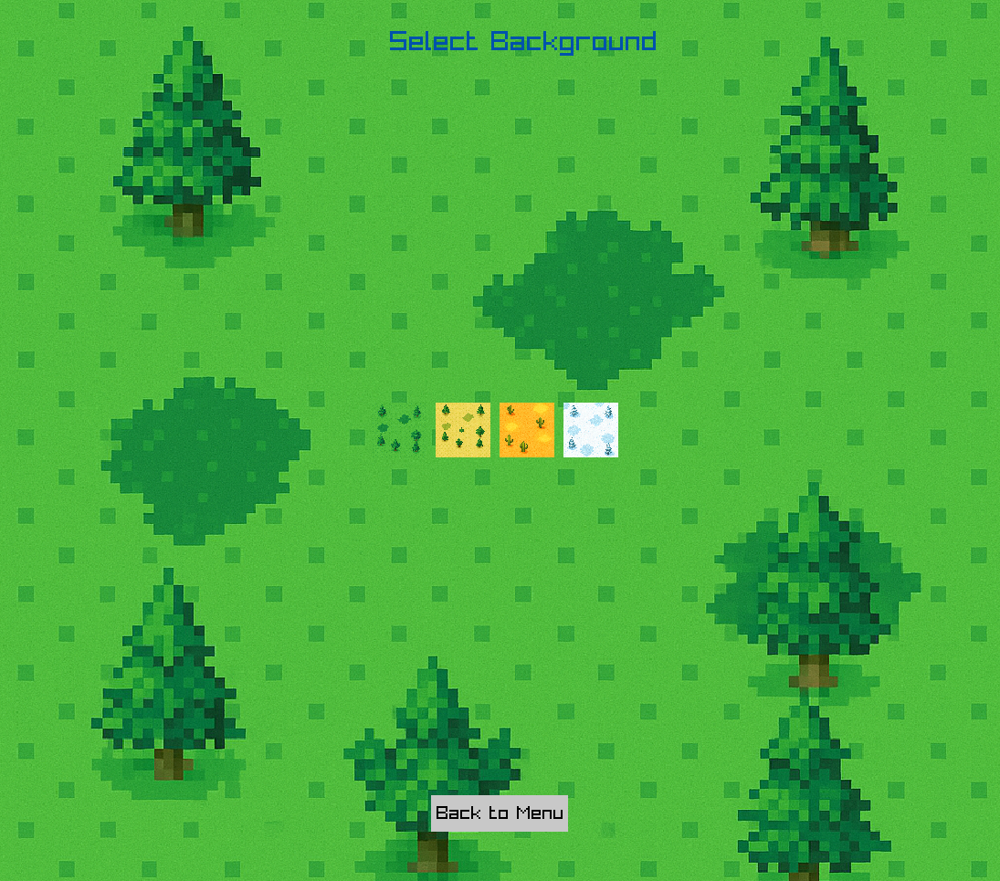
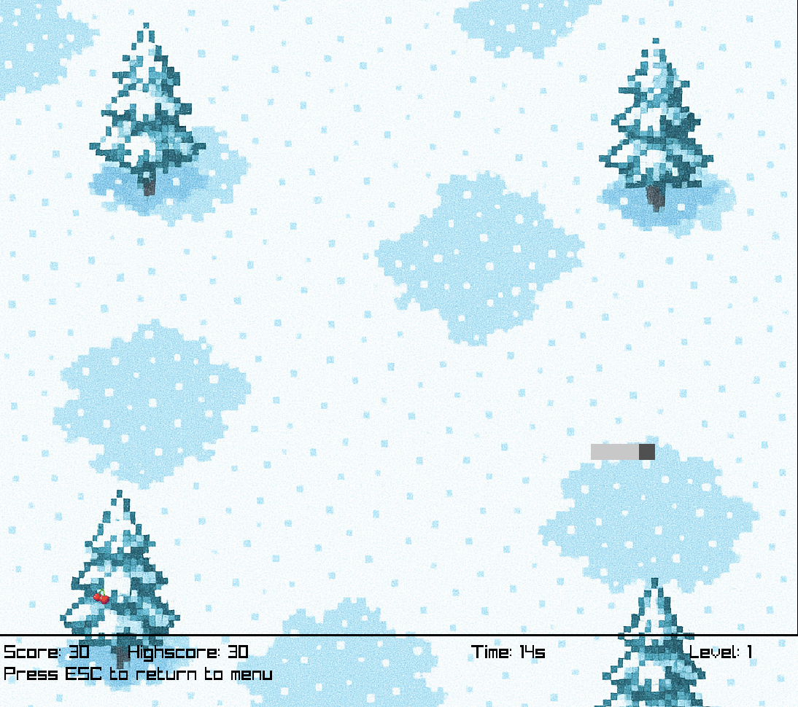
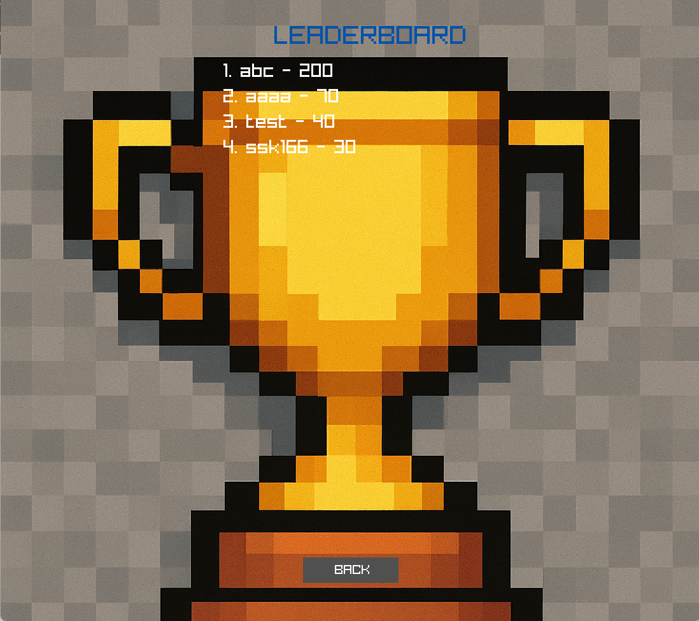

# Snake Game (Raylib + SQLite)

A graphical Snake Game built in C using the Raylib library. The game includes an account system backed by SQLite, allowing players to create accounts, log in, store highscores, and view a leaderboard.

---

## Features

- User account creation and login
- SQLite database for persistent player data and highscore tracking
- Leaderboard displaying top players
- Multiple background themes and fruit selection
- Multiple difficulty levels
- Sound effects and background music
- Menu-driven UI

---

## Technologies Used

- C Programming Language
- [Raylib](https://www.raylib.com/) — Graphics and Audio
- [SQLite3](https://www.sqlite.org/) — Database
- GCC Compiler / Makefile

---

## Project Structure
```
snake_raylib/
├── assets/
│   ├── backgrounds/
│   └── fruits/
├── audio/
├── include/
│   ├── accounts.h
│   ├── raylib.h
│   └── sqlite3.h
├── lib/
│   ├── accounts.c
│   └── sqlite3.c
├── main.c
├── Makefile
├── credits.txt
└── README.md
```

---

## Compilation

Using GCC directly:
```bash
gcc main.c lib/accounts.c -lraylib -lgdi32 -lwinmm -lsqlite3 -Llib -Iinclude -o main
```

Or with Make:
```bash
make
```

---

## Running
```bash
./main.exe
```

---

## Controls

| Key | Action |
|-----|--------|
| W | Move Up |
| A | Move Left |
| S | Move Down |
| D | Move Right |
| R | Restart after Game Over |
| ESC | Return to Menu |

---

## Database Structure

Player data is stored in a SQLite `Users` table with the following fields:

- **Username**
- **Password**
- **Highscore**
- **Coins**

Highscores are automatically updated when a player beats their previous record.

---

## Screenshots

| Account Menu | Login Screen | Main Menu |
|---|---|---|
|  |  |  |

| Fruit Selection | Background Selection | Gameplay | Leaderboard |
|---|---|---|---|
|  |  |  |  |
